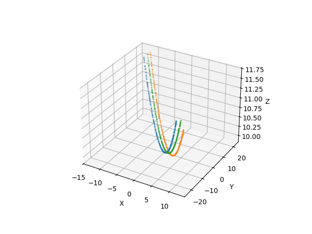
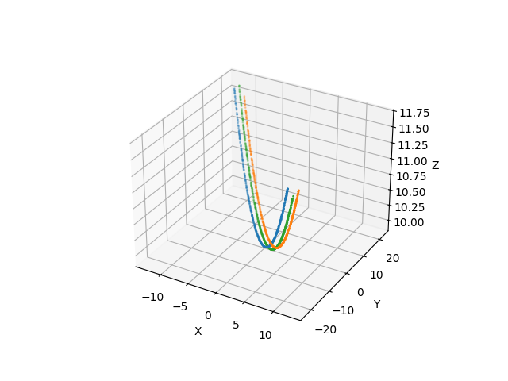

# LiDAR Cloud Point Cable Identification

By William Shirley

## Overview

A python package providing modelling for identifying cables within LiDAR cloud datasets, clustering the individual cables and then estimating the caternary properties of said cable. The model expects the data to be 3d (shape: (n ,3)).

## Modelling Approach

The model uses an adapted version of DBSCAN whereby identified neighbours of a point are validated as being part of the same cable as the current point. This filtering process uses the first principal component (PC1) of the data set, which always points in the same direction as the cables (constraints to this assumption do exist). As such, if the direction from the current point to the neighbour in question is perpendicular to PC1, the neighbour is likely part of a different cable. Thus, clusters should form around individual cables.

Once clusters have been indentified, the catenary constant is estimated by flattening the x & y axis and using the 2d curve formula with flat(x, y) and z as the formula's x,y coordinates, respectively.

### Current Limitations

- \_max_distance_to_nearest_neighbour() uses a crude approach to estimating the distance (is susceptible to outliers) between neighbours (the value provided as the eps param to dbscan). The method assume no outliers are present in the data set and all datapoints are members of a cable. Furthermore, As the sample size used within the method approaches 100%, the process requires O(n^2) runtime.
- Currently, caternary estimations that geometrically overlap are not recongised as being the same cable. As such, cables can be misidentified as >1 cable. Given more time, I believe this could be improved by checking for overlapping values within the estimated cables using the found curvature coefficeints.
- On the provided datasets, PC1 will always point along the direction of the cables. However, should a cable have sufficient slack, the direction of most variance could flip along the z-axis instead, invalidating the filtering approach.

## Installation

```bash
git clone https://github.com/WillShirley13/LiDAR_modelling.git
cd LiDAR_modelling
python -m venv venv
venv\Scripts\activate
pip install .
```

### Running the model

From the root directory, run:

```bash
lidar-cable-clustering
```

(Note: in order to run this command, the datasets must be in root/data/)

main.py can be directly executed to run the model on a desired dataset. The user can input the name of the dataset they wish to model and provide the sample size used to estimate the distance between neighbours.

## Project Structure

```
LiDAR_modelling/
├── pyproject.toml                          # Project config & dependencies
├── src/
│   └── lidar_cable_clustering/
│       ├── __init__.py
│       ├── main.py                         # Entry point for running model on desired dataset
│       ├── model.py                        # Model definition, logic and training
│       ├── utils.py                        # Helper functions
│       └── data_augmentation.py            # Data augmentation
├── data/                                   # Input datasets
└── results/                                # Output visualisations
```

## Example Results

Showing the predicted cables present in the dataset.



